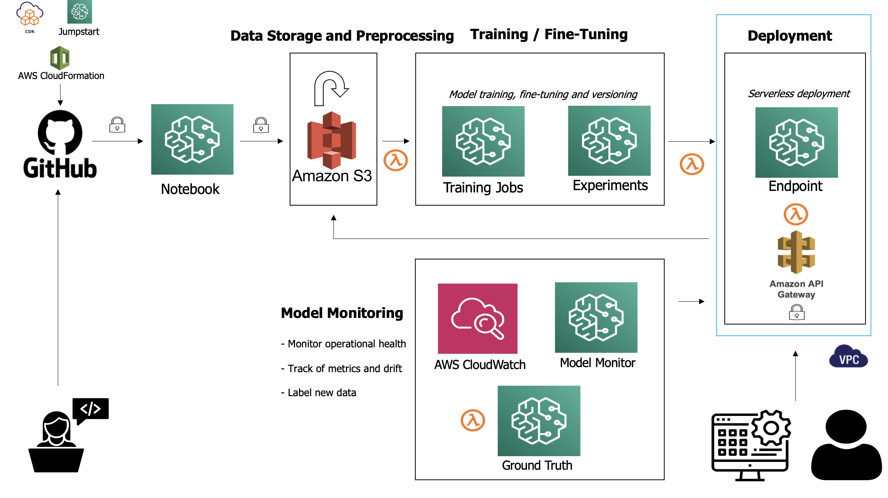

# Fine-Tuning a Multi-label Text Classifier on AWS

Welcome to the comprehensive guide for fine-tuning a multi-label text classifier for content moderation. This solution has been designed with your infrastructure in mind, fully utilizing the power of AWS, especially when local compute or GPUs are not available.

Table of Contents
=================

* [Overview](##Overview)
* [Why ROBERTA?](##Why-Roberta?)
* [Why OLID Dataset?](##Why-OLID-Dataset?)
* [Why DeepSpeed?](##Why-DeepSpeed?)
* [Directory Structure and Usage](##Directory-Structure-and-Usage)
* [Workflow](##Workflow)
* [MLOps Workflow](##MLOps-Workflow)
* [Feedback Loop](##Feedback-Loop)
* [Additional Considerations](##Additional-Considerations)
* [Containerizing with Docker](##Containerizing-with-Docker)

## Overview

The provided solution helps in fine-tuning the ROBERTA model on the OLID dataset for multi-label text classification. We've chosen the ROBERTA model due to its state-of-the-art performance in multiple NLP tasks, which can be crucial for accurate content moderation. **Note:** Please only refer to this guide as a brief overview as each directory contains its own in-depth documentation.

--------------------
```
.
├── README.md
├── requirements.txt
└── scripts
    ├── config
    │   ├── README.md
    │   ├── ds_config.json
    │   └── model_and_training_config.py
    ├── deployment
    │   ├── README.md
    │   ├── deploy_model.py
    │   └── inference.py
    ├── inference
    │   ├── README.md
    │   └── infer.py
    ├── training
    │   ├── README.md
    │   ├── launch_distributed_training.py
    │   ├── launch_training.py
    │   ├── preprocessing.py
    │   └── train.py
    └── utils
        ├── README.md
        ├── __init__.py
        └── utils.py
```
--------------------

## Why ROBERTA?

ROBERTA is a variation of the BERT model, which has been optimized for longer training with more data. Its robustness and flexibility make it an excellent choice for our task. Fine-tuning it on the OLID dataset ensures that the model is attuned to the nuances of online interactions.

## Why OLID Dataset?

The OLID dataset provides labels for online interactions, making it appropriate for a content moderation task. It's a well-regarded dataset in the NLP community for offensive language identification, and has had tremendous success in the literature with the [Zampieri et al.](https://aclanthology.org/S19-2010.pdf) paper (2019).

## Why DeepSpeed?

DeepSpeed is an optimization library that makes distributed training easy and efficient. While distributed training is primarily beneficial for large-scale tasks, DeepSpeed's optimizations can also accelerate training on smaller scales. The ability to scale across instances allows for faster iteration and model development.

# Directory Structure and Usage

1. `config`: Contains configuration files and model-related settings.
- For model and training settings, refer to `model_and_training_config.py`.
- DeepSpeed configuration can be found in `ds_config.json``.

2. `deployment`: Scripts related to deploying the trained model on AWS SageMaker.
- Use `deploy_model.py` to deploy your model.
- `inference.py` handles incoming requests for the deployed model.

3. `inference`: Contains the script (`infer.py`) to make predictions using the deployed model.

4. `training`: Scripts for training the model.
- `launch_training.py` for single-instance training.
- `launch_distributed_training.py` for distributed training across multiple instances.
- `train.py` contains the main training loop.
- Preprocessing script (`preprocessing.py`) for reading and preparing data is also located here.

5. `utils`: Utility functions, e.g., for reading data from S3.

## Workflow

1. Clone the repository

You may wish to do this in a virtual environment as follows:

```shell script
# Install virtualenv if you haven't already
pip install virtualenv

# Create a new virtual environment named 'venv' or any name you prefer
virtualenv venv

# Activate the virtual environment
# For Windows: .\venv\Scripts\activate
# For MacOS/Linux:
source venv/bin/activate

# Now, clone the repository and navigate to the desired directory
git clone git@github.com:jamesliounis/HuggingFace-TakeHome.git
cd src/fine_tune_classifier
```

2. Data Movement:
Start by downloading the dataset from the given Google Drive link and uploading it to an S3 bucket. 

```shell script
# Install necessary tools
pip install gdown awscli

# Download the dataset
gdown "https://drive.google.com/uc?id=1Tksi8UyzW-drFWd7maGr7MoHVa-VHQCO" -O olid_dataset.zip

# Unzip the dataset
unzip olid_dataset.zip

# Upload the dataset to your S3 bucket
aws s3 cp olid_dataset/ s3://your_bucket_name/path_to_data/ --recursive
```
3. Preprocessing

Preprocess your data to prepare it for training.

```shell script
python scripts/training/preprocessing.py
```

4. Training 
- For non-distributed training
```shell script
python scripts/training/launch_training.py
```
- For distributed training
```shell script
python scripts/training/launch_distributed_training.py
```

5. Deployment

Deploy your trained model on SageMaker.

```shell script
python scripts/deployment/deploy_model.py
```
6. Inference

Make predictions using the deployed model. 

```shell script
python scripts/inference/infer.py --input-text "Your text here"
```

---

### MLOps Workflow



#### 1. AWS CDK (Cloud Development Kit) and SageMaker JumpStart:
**Purpose**: Enhanced Infrastructure-as-Code Capabilities and Accelerated Machine Learning Prototyping.
- **AWS CDK (Cloud Development Kit)**: An open-source software development framework to define cloud infrastructure in code and provision it through AWS CloudFormation. CDK offers high-level constructs that reduce the boilerplate code needed to define cloud resources.
- **SageMaker JumpStart**: Part of Amazon SageMaker designed to expedite ML adoption. JumpStart provides pre-built CDK Scripts to seamlessly set up and manage the ML infrastructure using AWS CDK without the need to define resources from scratch.By leveraging the pre-built CDK scripts in SageMaker JumpStart, one can streamline the process of infrastructure deployment while ensuring best practices are followed. This combination empowers users to focus more on ML experimentation and application while spending less time on infrastructure management.

#### 2. AWS CloudFormation and GitHub:
**Purpose**: Infrastructure-as-Code (IaC) and Version Control.
- **AWS CloudFormation**: Automates and manages the AWS infrastructure. Enables reproducibility of the infrastructure, ensuring consistency across different stages of the ML lifecycle.
- **GitHub**: Functions as the central repository for all project artifacts, including data scripts, model definitions, and configurations. Integrated hooks can trigger automated CI/CD pipelines upon code changes.

#### 2. Notebook:
**Purpose**: Data Exploration and Pre-processing.
- **Jupyter Notebook**: Facilitates data exploration, visualization, and pre-processing. Acts as an interactive platform where data scientists can test and develop preprocessing logic. Can be integrated with version control for tracking notebook versions.

#### 3. Data Storage and Preprocessing:
**Purpose**: Centralized data storage and data preparation.
- **Amazon S3**: Robust and scalable object storage service. Stores raw data, processed datasets, and model artifacts.
- **Data Flow**: Automation scripts fetch raw data, process it using code from GitHub, and deposit processed datasets in S3 for training. This flow can be event-driven to respond to new data arrivals.

#### 4. Training/Fine-Tuning:
**Purpose**: Model development and optimization.
- **Training Jobs**: Automated training pipelines spin up AWS instances, leveraging SageMaker's capabilities (i.e., SageMaker's training service). They use data from S3 and configurations from GitHub.
- **Experiments**: Enable automated tracking of model iterations. Allows for tracking and comparing different model versions, hyperparameters, and performance.

#### 5. Deployment:
**Purpose**: Seamless Model Deployment and Scaling.
- **Endpoint**: Deploys models automatically to SageMaker endpoints upon successful training/validation. Monitoring tools track endpoint health. This is the interface through which external applications send data for predictions.
- **Amazon API Gateway**: Provides a serverless solution. Handles and manages API requests automatically. Serves as a secured interface for clients to access the deployed model.

#### 6. Model Monitoring:
**Purpose**: Real-time Performance Insights.
- **AWS CloudWatch**: Provides automated alerts based on predefined performance thresholds and system health metrics.
- **Model Monitor**: Specifically focused on deployed model's performance. Actively checks for model drift or anomalies. Automates re-training triggers if performance degrades.
- **Ground Truth**: Amazon SageMaker's data labeling service. Uses automated pipelines to help in re-labeling misclassified samples, thereby creating a feedback loop for continuous model improvement.

#### Feedback Loop:
**Purpose**: Continuous Improvement.
- **Data Re-ingestion**: Automated mechanisms capture and store model predictions. Incorrect predictions are queued for review and labeling, ensuring that the model continuously learns and adapts.

#### Additional Considerations:
- **Error Handling**: Integrated mechanisms to manage and rectify errors during training, deployment, or inference. Currently integrated in code, but would need to be integrated in workflow. 
- **CI/CD Integration**: Continuous Integration and Continuous Deployment processes ensure smooth and automated transitions between different phases, especially when changes are made in GitHub.
- **Model Versioning**: Every trained model is versioned, ensuring traceability, easy rollbacks, and performance comparisons.
- **Security**: Measures in place to secure data, API endpoints, and other sensitive components.
- **Scalability**: Provisions to scale the training and deployment infrastructure based on the demand and data volume.


---
